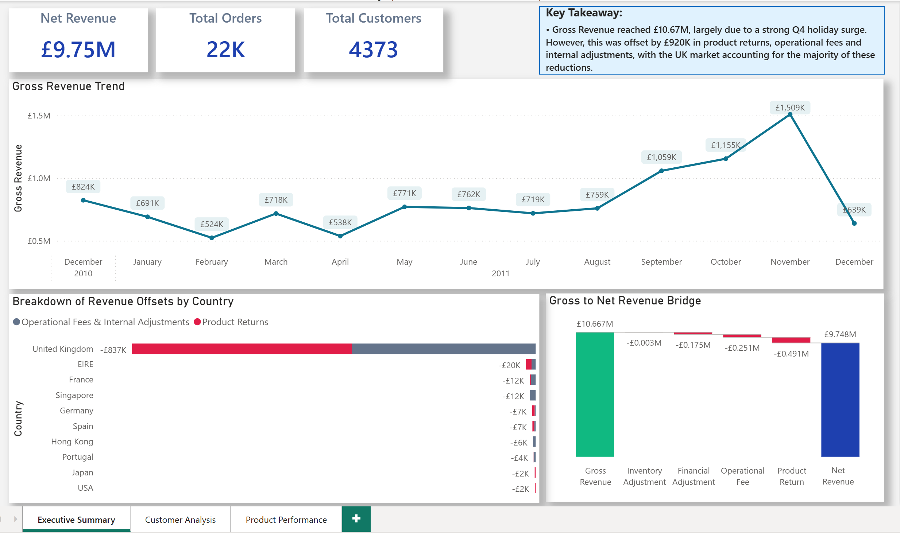
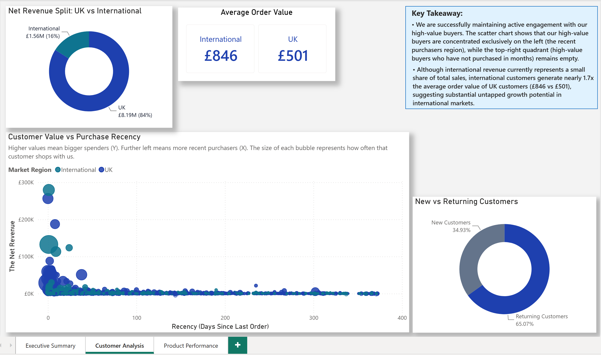
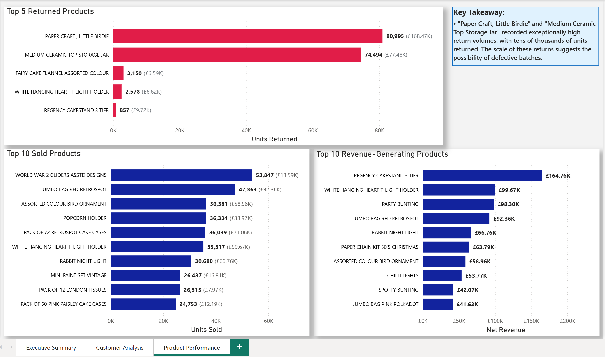

# 🛒 E-Commerce Revenue, Customer & Product Analytics Dashboard

An interactive Power BI dashboard analysing **541,000+ transaction records** from a UK-based online retailer (2010–2011), uncovering revenue trends, customer behaviour, and product performance across global markets.

---

## 📊 Dashboard Overview

The report is structured across three pages:

### 1. Executive Summary

A high-level assessment of revenue performance and profitability drivers.

* The business generated £10.67M in gross revenue and retained £9.75M in net revenue across 22K orders from 4,373 customers.
* Revenue was heavily concentrated in Q4, with monthly gross revenue reaching a peak of £1.51M in November 2011.
* Approximately £920K (8.6% of gross revenue) was offset by product returns, operational fees, inventory adjustments, and financial adjustments.
* The UK accounted for the overwhelming majority of revenue offsets, making it the primary contributor to overall revenue reductions.

---

### 2. Customer Analysis

Deeper insight into who is buying and how they behave.

* UK customers make up **84%** of net revenue (£8.19M), while international customers represent **16%** (£1.56M)
* Despite lower volume, international customers generate **1.7× the average order value** (£846 vs £501), signalling significant untapped growth potential
* A Customer Value vs Purchase Recency scatter plot confirms that high-value buyers remain actively engaged (concentrated in the recent purchaser zone)
* **65%** of customers are returning buyers — a strong indicator of customer loyalty

---

### 3. Product Performance

A breakdown of what drives volume versus revenue.

* **Top sellers by units:** World War 2 Gliders Assorted Designs (53,847 units) and Jumbo Bag Red Retrospot (47,363 units)
* **Top revenue generators:** Regency Cakestand 3 Tier (£164.76K) and White Hanging Heart T-Light Holder (£99.67K)
* **Returns spotlight:** Paper Craft, Little Birdie (80,995 units) and Medium Ceramic Top Storage Jar (74,494 units) recorded exceptionally high return volumes, suggesting the possibility of defective batches.

---

## 🛠️ Tools & Skills

| Tool                 | Purpose                                                                     |
| -------------------- | --------------------------------------------------------------------------- |
| **Power BI Desktop** | Data modelling, DAX measures, and interactive visualisations                |
| **Power Query (M)**  | Data cleaning, transformation, and column derivation                        |
| **DAX**              | Custom measures, KPIs, revenue calculations, and customer analytics metrics |

---

## 📁 Dataset

**Source:** https://www.kaggle.com/datasets/carrie1/ecommerce-data

**Description:** Transactional data from a UK-based online retail company that sells all-occasion gifts. The dataset contains all transactions recorded between December 2010 and December 2011.

| Field         | Description                           |
| ------------- | ------------------------------------- |
| `InvoiceNo`   | Unique invoice number per transaction |
| `StockCode`   | Product code                          |
| `Description` | Product name                          |
| `Quantity`    | Number of units per transaction       |
| `InvoiceDate` | Date and time of invoice              |
| `UnitPrice`   | Price per unit (£)                    |
| `CustomerID`  | Unique customer identifier            |
| `Country`     | Country of the customer               |

* **Rows:** ~541,000 transactions
* **Period:** December 2010 – December 2011
* **Markets:** UK (primary) plus multiple international markets
